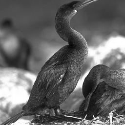
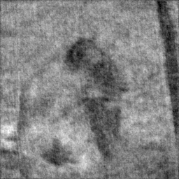
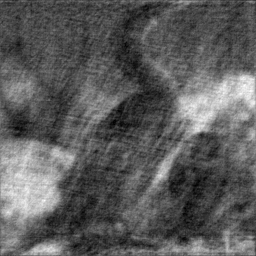
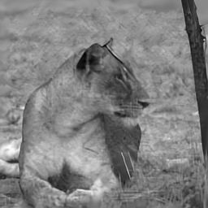

# [Deep Plug-and-Play HIO Approach for Phase Retrieval](https://arxiv.org/abs/2411.18967)
Çağatay Işıl and Figen S. Oktem

This repository contains the official codes for the paper "[Deep Plug-and-Play HIO Approach for Phase Retrieval](https://opg.optica.org/view_article.cfm?pdfKey=5a170bac-ba65-4546-91073f8c45b177f4_567729)", Applied Optics, vol. 64, no. 5, pp. A84-A94, 2025. ([arXiv](https://arxiv.org/abs/2411.18967) )

Initially, we uploaded MATLAB-CPU version of our implementation.

## Abstract
In the phase retrieval problem, the aim is the recovery of an unknown image from intensity-only measurements such as Fourier intensity. Although there are several solution approaches, solving this problem is challenging due to its nonlinear and ill-posed nature. Recently, learning-based approaches have emerged as powerful alternatives to the analytical methods for several inverse problems. In the context of phase retrieval, a novel plug-and-play approach that exploits learning-based prior and efficient update steps has been presented at the Computational Optical Sensing and Imaging topical meeting, with demonstrated state-of-the-art performance.The key idea was to incorporate learning-based prior to the Gerchberg-Saxton type algorithms through plug-and-play regularization. In this paper, we present the mathematical development of the method including the derivation of its analytical update steps based on half-quadratic splitting and comparatively evaluate its performance through extensive simulations on a large test dataset. The results show the effectiveness of the method in terms of image quality, computational efficiency, and robustness to initialization and noise.

  

    <strong>Original images</strong> 
    
    
    <!-- Add more input images as needed -->
  

  

    <strong>HIO-Output images</strong> 
    
    

  

  

    <strong>PPHIO-Output images</strong> 
    
    

  

## How to start
* Download Packages.zip file from this [link](https://drive.google.com/drive/folders/1f9eNcxyflmZJ7G47pdd6KyEzRdBxuTiU?usp=drive_link) and unzip into the same folder.
* Run main_matlab_cpu.py file in your CPU.

## Requirements
* MATLAB
